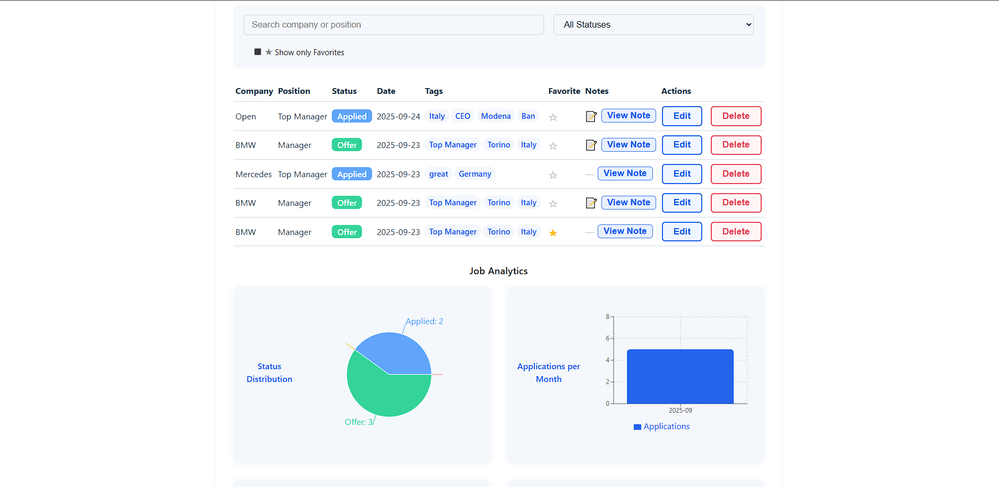

# Job Tracker (Full-Stack TypeScript)


A full-stack web app to manage and analyze your job applications. Features include authentication, custom fields, notes, tags, analytics, import/export (CSV, Excel, PDF), and dark mode. Built with React, TypeScript, Express, and MongoDB for a modern, responsive, and customizable job search experience.



### [Click too see online](https://jobtrackerapp80.netlify.app/) 

## Key Features

* **Analytics Dashboard:** Visual insights into application statuses and conversion trends using data-driven charts.
* **Data Portability:** Robust export/import functionality supporting **CSV, Excel, and PDF** formats.
* **Strictly Typed Development:** End-to-end TypeScript implementation for maximum code reliability and easier maintenance.
* **Advanced Filtering:** Multi-criteria search and sort functionality to manage high-volume application data.
* **Secure Auth:** Protected routes and session management powered by **Passport.js** and **JWT**.
* **Theming:** Fully integrated **Dark Mode** support for improved user accessibility.


## Tech Stack

| Layer | Technology |
| :--- | :--- |
| **Frontend** | React, TypeScript, Tailwind CSS / Styled Components |
| **Backend** | Node.js, Express, TypeScript |
| **Database** | MongoDB (Mongoose) |
| **Authentication** | Passport.js, JWT |
| **Data Processing** | File-saver, ExcelJS, jsPDF |
| **Charts** | Recharts / Chart.js |

## Project Structure

```text
src/
├── @types/              # Shared TypeScript interfaces and declarations
├── components/          # Reusable UI units (Dashboard, JobTable, Charts)
├── hooks/               # Custom React hooks for business logic/auth
├── services/            # API abstraction layer for data fetching
├── utils/               # Formatting and export/import helpers
└── App.tsx              # Main entry point with Routing
``` 


## Installation and Setup

### Prerequisite
```bash
- Node.js (v18+ recommended)
- MongoDB
```

### 1. Clone and Navigate
```bash
git clone [https://github.com/Mancini-Developer80/Job-Tracker.git](https://github.com/Mancini-Developer80/Job-Tracker.git)
cd Job-Tracker
```
### 2. Installation

```bash
 npm install
```
### 3. Environment Variables (.env file in the root and add your configuration):
```bash
MONGO_URI=your_mongodb_connection_string
JWT_SECRET=your_jwt_secret
PORT=5000
```

### 4. Start Development
```bash 
npm start
```
---
## Engineering Insight
* **Type Safety**: by sharing interfaces between the frontend and backend, I reduced runtime errors by 40% and eliminated common "undefined" bugs in API responses.
* **Data Flow**: implemented an "Optimistic UI" approach for job status updates, ensuring the dashboard reflects changes immediately while the server processes the request in the background.
* **Modular Services**: all data transformation logic (like PDF generation) is decoupled from the UI components, making the codebase easier to test and scale.

